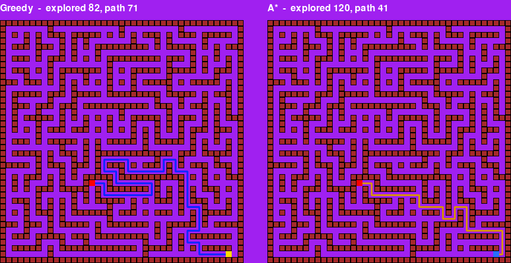
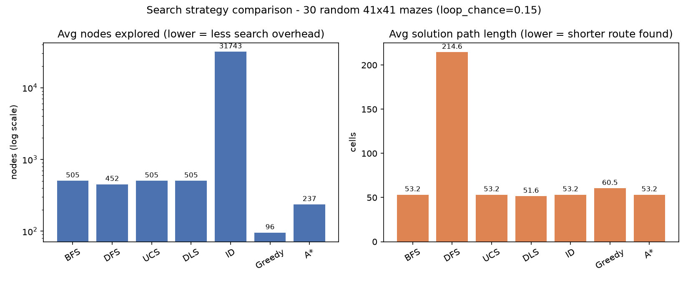

# Search-Strategies-Game

A PyGame visualisation of classic search strategies used in old school AI, the game shows two agents race who each other to the exit of the same randomly generated maze, each using a different search algorithm. Watching the algorithms run side by side on identical terrain makes their trade-offs visible, I personally found this benefical for understanding.



Seven strategies are implemented: **BFS**, **DFS**, **Uniform Cost Search**,
**Depth-Limited Search**, **Iterative Deepening**, **Greedy Best-First
Search**, and **A\***.

## Running the game

```bash
pip install -r requirements.txt
python3 init.py
```

Pick an algorithm for each agent from the menu, click **Start Race**, and
watch. Each panel first reveals the cells the algorithm explored (in the
order it explored them), then draws the final solution route in a colour
that contrasts with the agent, and finally walks the agent along it. Console
output at the end reports nodes explored, max search depth, and solution
path length for both agents.

## Project layout

| File | What it does |
|---|---|
| `search.py` | Maze generation and all 7 search strategies. No PyGame dependency, so it's importable headlessly by tests and the benchmark script. |
| `init.py` | The game itself: PyGame setup, the agent/rendering classes, the algorithm-selection menu, and the race loop. |
| `tests/` | pytest suite covering maze generation and search-algorithm correctness. |
| `benchmark.py` | Runs all 7 algorithms across many random mazes and reports nodes explored / path length / time, as a CSV and a chart. |
| `render_preview.py` | Regenerates `docs/preview.png` (the screenshot above) headlessly. |

## Tests

```bash
python3 -m pytest
```

43 tests, covering:
- **Maze generation** - correct dimensions, a solid border, full connectivity
  (no unreachable pockets) both before and after loops are added.
- **Every algorithm** - returns a valid path when one exists (each step
  in-bounds, open, and 4-adjacent to the last), correctly reports failure
  when the goal is unreachable, and handles the trivial start-equals-goal
  case.
- **Optimality** - BFS, UCS, Iterative Deepening, and A* are asserted to
  match a BFS reference path length across 10 random mazes each - i.e. they
  actually find a *shortest* path, not just *a* path. DFS and Greedy are
  deliberately not held to that standard, since neither algorithm gives that
  guarantee.
- **Depth-Limited Search** - respects its depth cap instead of overrunning it.

## Benchmark

```bash
python3 benchmark.py --trials 30
```

Generates fresh random mazes, runs every algorithm against the same
start/goal pair on each one, and reports nodes explored and solution path
length per algorithm. Sample output (30 trials, 41x41 mazes, `results/`):



A few things this makes visible:
- **BFS, UCS, DLS, ID, and A\*** all land on exactly the same average path
  length - confirming they're all finding the *optimal* route, as they're
  supposed to.
- **Greedy** explores far fewer nodes than the optimal strategies but
  settles for a noticeably longer path - the classic speed-for-optimality
  trade-off of ignoring path cost entirely.
- **Iterative Deepening** pays a real, visible cost for its low memory
  footprint: it re-explores the shallow part of the search tree once per
  depth increment, so its total nodes-explored count dwarfs every other
  algorithm's even though it still finds the optimal path.

## Design notes

**Why the maze has loops.** A maze carved by plain randomized-DFS
backtracking is a *perfect maze* - a spanning tree with exactly one route
between any two cells. That's a problem for comparing search strategies: if
there's only one possible path, every algorithm that finds a path finds the
*same* path, and A*'s whole reason for existing (finding the *shortest*
route when several exist) never comes into play. `add_loops()` knocks down a
random fraction of the remaining walls after carving, so real alternate
routes exist and A* actually has something to be right about.

**Why A* uses `best_cost`, not a `visited` set.** Greedy Best-First can get
away with marking a cell visited the moment it's pushed to the frontier,
because it never claims optimality. A* can't: with a consistent heuristic,
optimality depends on being able to replace an already-queued cell with a
cheaper route to it if one turns up later. `AStar` and `UniformCostSearch`
both track a `best_cost` dict and skip stale queue entries instead, mirroring
each other deliberately.

**Why Iterative Deepening tracks `best_cost`-style depths too.** The same
issue bit Iterative Deepening once loops were added: its original
`child not in prev` guard treated the *first* DFS route to a cell as final,
even if a shorter route to that same cell existed and just hadn't been
explored yet. On a perfect maze (no loops) that's harmless, since only one
route to any cell ever exists - which is exactly why the bug stayed hidden
until loops were introduced. It's fixed the same way A*/UCS handle it: only
skip a cell if the route already on file is at least as short.
